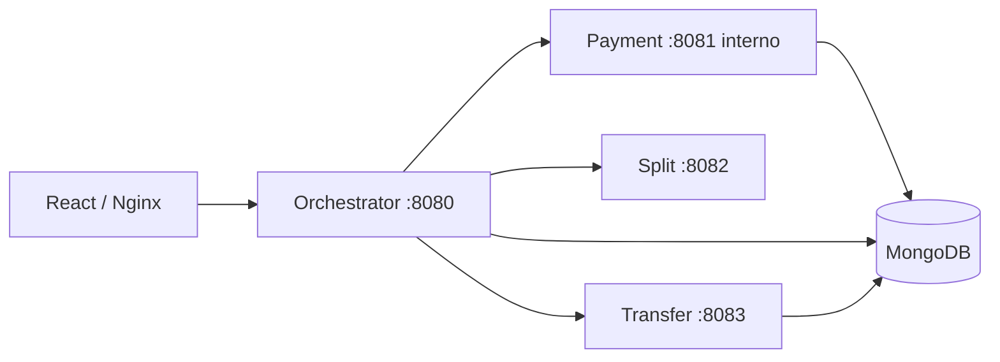

# Spring Split Payment Lab

Projeto full stack de estudo para reproduzir e explicar problemas comuns em arquiteturas de microsserviços: comunicação síncrona, timeout, retry, circuit breaker, idempotência, correlation ID e Saga com orquestração e compensação.

O laboratório processa um pagamento de marketplace, separa 90% para o vendedor e 10% para a plataforma e registra a transferência. A interface permite executar falhas controladas e observar o estado final da Saga.

## Arquitetura



| Componente | Responsabilidade |
|---|---|
| `frontend` | Executar e visualizar os cenários de estudo |
| `orchestrator-service` | Coordenar a Saga e persistir seu estado |
| `payment-service` | Criar pagamentos e controlar seus estados |
| `split-service` | Calcular a divisão 90/10 e simular lentidão |
| `transfer-service` | Persistir transferências e executar compensação |
| MongoDB | Bancos separados logicamente para payment, transfer e Saga |

## Conceitos demonstrados

- Controller, Service e Repository
- Injeção por construtor
- JUnit 5 e Mockito
- MongoDB e índices únicos
- Comunicação HTTP entre microsserviços
- Connect timeout e read timeout
- Retry exponencial e circuit breaker com Resilience4j
- Idempotência com detecção de conflito
- Saga com orquestração e compensação
- Correlation ID propagado entre serviços
- React, Vite, Nginx e Docker Compose

## Executar tudo

Pré-requisitos: Docker e Docker Compose.

```bash
docker compose up --build
```

Abra [http://localhost:3000](http://localhost:3000).

Portas locais:

| Aplicação | URL |
|---|---|
| Frontend | `http://localhost:3000` |
| Orchestrator | `http://localhost:8080` |
| Payment | `http://localhost:8181` (porta interna `8081`) |
| Split | `http://localhost:8082` |
| Transfer | `http://localhost:8083` |
| MongoDB | `localhost:27017` |

O payment usa `8181` externamente para evitar colisões frequentes com aplicações locais em `8081`; dentro da rede Docker ele continua em `8081`.

## Cenários da interface

### 1. Fluxo saudável

```text
payment CREATED → split 90/10 → transfer COMPLETED → payment COMPLETED
```

Resultado esperado da Saga: `COMPLETED`.

### 2. Timeout + retry + circuit breaker

O `split-service` demora 2,5 segundos. O orquestrador possui read timeout de 1 segundo e executa até três tentativas com backoff exponencial.

Após falhas suficientes, o circuit breaker abre por 10 segundos e impede novas chamadas ao serviço lento. Durante essa janela, outros fluxos que dependem do split também falham rapidamente. Depois, o circuito entra em half-open para testar a recuperação.

Resultado esperado: `FAILED`, sem transferência financeira para compensar.

### 3. Falha + compensação

O `transfer-service` persiste a transferência e responde com erro controlado. O orquestrador detecta que a etapa financeira foi tentada, chama a compensação e atualiza payment e transfer.

Resultado esperado: `COMPENSATED`.

Se esse cenário for executado imediatamente depois de abrir o circuit breaker, aguarde 10 segundos ou execute-o antes do cenário de timeout. O bloqueio temporário é parte intencional do experimento.

## Idempotência

Enviar novamente a mesma `idempotencyKey`, `transactionId` e valor retorna a Saga existente sem repetir os efeitos.

Reutilizar a mesma chave com dados diferentes retorna `409 Conflict`:

```json
{"error":"Idempotency key was already used with different payment data"}
```

Índices únicos no MongoDB preservam a integridade mesmo diante de requisições concorrentes. Em um sistema de produção, também seria necessário tratar explicitamente uma corrida que resulte em `DuplicateKeyException`.

## Correlation ID e diagnóstico

O header `X-Correlation-ID` é aceito pelo orquestrador, propagado aos demais serviços e incluído nos logs. Se o cliente não o fornecer, um UUID é criado.

```bash
docker compose logs -f orchestrator-service split-service transfer-service payment-service
```

Isso permite seguir uma mesma requisição atravessando processos diferentes.

## Executar os testes

Backend completo:

```bash
mvn test
```

Frontend:

```bash
cd frontend
npm install
npm run build
```

Os testes cobrem regras do payment, cálculo do split e os caminhos de conclusão e compensação do orquestrador. MongoDB não é acessado pelos testes unitários.

## API principal

Criar um fluxo:

```bash
curl -X POST http://localhost:8080/api/payment-flows \
  -H 'Content-Type: application/json' \
  -H 'X-Correlation-ID: demo-123' \
  -d '{
    "transactionId": "tx-demo-123",
    "amount": 100.00,
    "idempotencyKey": "key-demo-123",
    "simulation": "NONE"
  }'
```

Valores de `simulation`: `NONE`, `SPLIT_TIMEOUT`, `SPLIT_FAILURE` ou `TRANSFER_FAILURE`.

Consultar:

```bash
curl http://localhost:8080/api/payment-flows/tx-demo-123
```

## Decisões importantes

- Retry foi aplicado no cálculo do split, uma operação sem efeito financeiro.
- Transfer não possui retry automático; uma repetição cega de POST financeiro pode duplicar efeitos.
- O estado da Saga é persistido antes e depois de cada etapa relevante.
- A compensação é uma nova operação de negócio, não um rollback distribuído de banco.
- Cada serviço mantém sua própria responsabilidade e não acessa diretamente os dados dos outros.

## Limitações intencionais

Este é um laboratório, não um sistema financeiro pronto para produção. Para evoluí-lo seriam necessários autenticação, autorização entre serviços, secrets, tracing distribuído, métricas e alertas, outbox/event broker, locking ou insert atômico para concorrência, política de recuperação manual e testes de integração com Testcontainers.

O guia [docs/learning-guide.md](docs/learning-guide.md) relaciona cada cenário às perguntas de entrevista.

Para parar os contêineres:

```bash
docker compose down
```

Use `docker compose down -v` somente quando também quiser apagar os dados locais do MongoDB.
