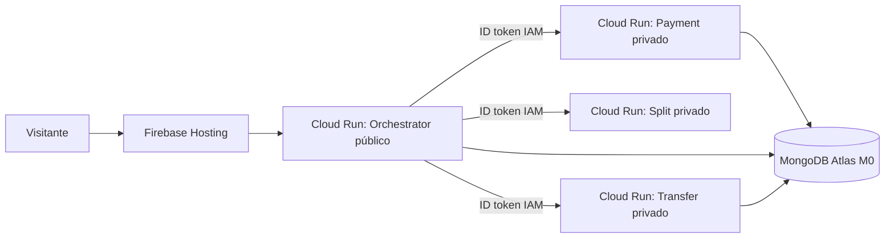

# Publicar o laboratório no Google Cloud

Este roteiro publica um **ambiente demonstrativo**, não um sistema financeiro real.
Não use cartões, documentos, nomes de clientes ou qualquer outro dado verdadeiro.

## Arquitetura do ambiente público



Controles incluídos:

- máximo de uma instância por serviço e escala até zero;
- Payment, Split e Transfer recusam chamadas sem identidade IAM;
- credencial do MongoDB armazenada no Secret Manager;
- limite global de 30 criações por minuto no ambiente demonstrativo;
- dados apagados automaticamente pelo MongoDB após sete dias;
- headers de segurança e HTTPS no Firebase Hosting;
- tela de preparação que aguarda os cold starts antes de liberar os testes;
- orçamento de Cloud Run configurado separadamente no Console.

## O que ainda depende do proprietário da conta

Os scripts não criam uma conta externa nem aceitam cobranças. Antes do primeiro
deploy, o proprietário precisa:

1. ter faturamento ativo no projeto `spring-split-payment-lab`;
2. configurar orçamento e limite de gastos;
3. criar um cluster gratuito no MongoDB Atlas;
4. executar os scripts autenticado no Cloud Shell;
5. adicionar o projeto existente ao Firebase.

## 1. Criar o MongoDB Atlas M0

1. Entre em [MongoDB Atlas](https://www.mongodb.com/cloud/atlas/register).
2. Crie um projeto chamado `spring-split-payment-lab`.
3. Crie um cluster **M0 Free**.
4. Prefira Google Cloud e uma região próxima de `us-central1`, quando disponível.
5. Crie um usuário exclusivo para a aplicação, com senha longa e aleatória.
6. Conceda acesso de leitura e escrita aos bancos da aplicação, sem papel de administrador.
7. Em **Network Access**, autorize as conexões necessárias.

O plano gratuito do Cloud Run não fornece IP de saída fixo. Para este laboratório,
o caminho sem custo é permitir acesso de qualquer IP no Atlas e depender de TLS,
usuário e senha fortes. Essa é uma limitação consciente da demonstração. Um sistema
real deveria usar saída estática ou conectividade privada e restringir a lista de IPs.

Copie a URI no formato `mongodb+srv://...`. Não coloque essa URI em arquivo, commit,
print ou mensagem pública.

## 2. Abrir o Cloud Shell

No Console do Google Cloud, selecione o projeto `spring-split-payment-lab` e clique
no ícone de terminal no canto superior direito.

Clone o repositório:

```bash
git clone https://github.com/pmarsiglia93/spring-split-payment-lab.git
cd spring-split-payment-lab
```

Confirme a identidade e o projeto antes de continuar:

```bash
gcloud auth list
gcloud config get-value project
```

O projeto exibido deve ser `spring-split-payment-lab`.

## 3. Preparar a infraestrutura

```bash
./infra/google-cloud/bootstrap.sh
```

Esse script habilita APIs, cria o repositório de imagens, quatro contas de serviço
com identidades separadas e o secret vazio `mongodb-uri`.

Adicione a URI do Atlas sem exibi-la no terminal:

```bash
./infra/google-cloud/configure-mongodb-secret.sh
```

O valor digitado vai diretamente ao Secret Manager e não é salvo no repositório.

## 4. Construir e publicar os microsserviços

```bash
./infra/google-cloud/deploy.sh
```

O script:

1. constrói quatro imagens no Cloud Build;
2. envia as imagens ao Artifact Registry;
3. publica os três serviços internos sem acesso anônimo;
4. concede ao Orchestrator somente a permissão `Cloud Run Invoker` necessária;
5. publica o Orchestrator com acesso público para o proxy do Firebase;
6. limita todos os serviços a zero ou uma instância.

## 5. Ativar o Firebase no projeto existente

1. Abra o [Firebase Console](https://console.firebase.google.com/).
2. Clique em **Adicionar projeto**.
3. Selecione o projeto existente `spring-split-payment-lab`.
4. O Google Analytics é opcional e pode ficar desabilitado neste laboratório.
5. Não crie um segundo projeto com nome semelhante.

No Cloud Shell, publique o frontend:

```bash
npm --prefix frontend ci
npm --prefix frontend run build
npx firebase-tools deploy --only hosting --project spring-split-payment-lab
```

Ao final, o endereço esperado será semelhante a:

```text
https://spring-split-payment-lab.web.app
```

## 6. Validar depois do deploy

1. Abra a URL do Firebase em uma janela anônima.
2. Aguarde o painel **Preparando o laboratório** concluir os quatro serviços.
3. Execute **Fluxo saudável** e confirme `COMPLETED`.
4. Repita sem trocar os identificadores e confirme que a Saga é reutilizada.
5. Gere uma ID e execute **Falha + compensação**; espere `COMPENSATED`.
6. Execute **Timeout + retry** por último; espere `FAILED` e a proteção de 10 segundos.
7. Confirme no Console que Payment, Split e Transfer não permitem acesso anônimo.
8. Confira Faturamento e Cloud Logging sem copiar credenciais ou dados sensíveis.

## Diagnóstico e interrupção

Ver serviços e URLs:

```bash
gcloud run services list --region us-central1
```

Ver logs recentes do Orchestrator:

```bash
gcloud run services logs read orchestrator-service --region us-central1 --limit 50
```

Se precisar interromper o ambiente imediatamente, remova o tráfego público do
Orchestrator pelo Console do Cloud Run. Excluir serviços ou secrets é uma operação
destrutiva e deve ser feita somente depois de confirmar os alvos.

## Limites assumidos

- cold start é aceito e explicado pela interface;
- o MongoDB M0 não oferece a alta disponibilidade de um ambiente financeiro;
- o rate limit em memória é adequado a uma única instância demonstrativa;
- o Orchestrator é público para permitir o rewrite do Firebase Hosting;
- não há autenticação de usuário final, portanto somente dados fictícios são aceitos;
- alta disponibilidade, IP fixo, WAF, tracing e backups ficam fora do orçamento do laboratório.
